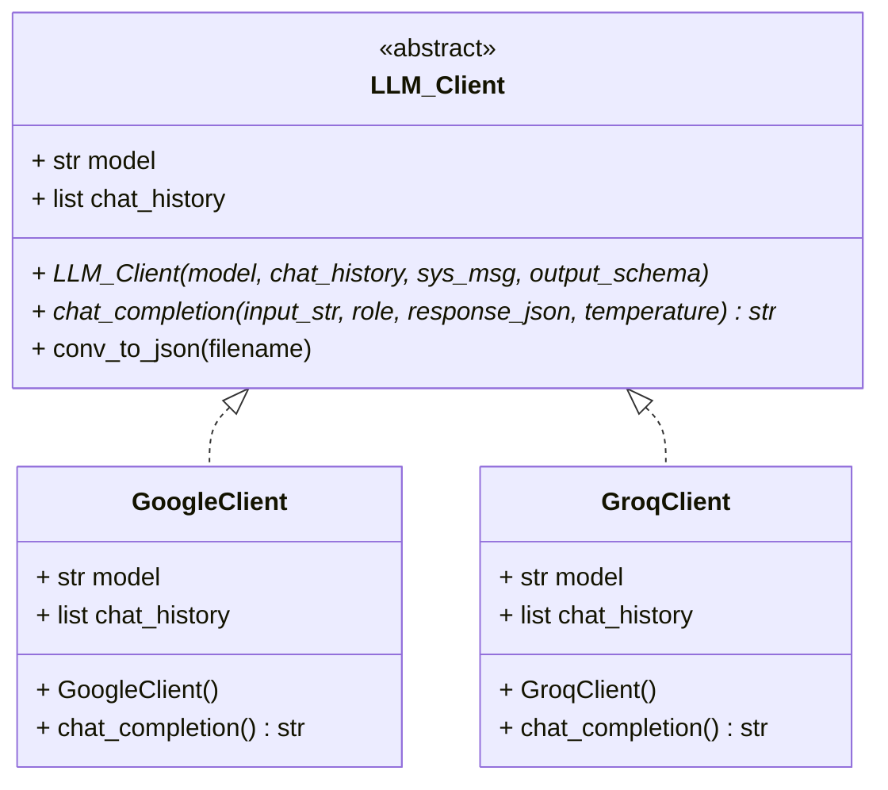

# Deskquery LLM Integration

### LLM Client Interface

The `llm_api.py` file provides the abstract interface for integrating LLM clients, so they can be used as
expected by the system.

The current abstract interface and realizations are the following:



Further clients may be added by implementing a realization of the abstract `LLM_Client` interface.

### LLM API key configuration

To enable language model access, create an `.env` file for the LLM API to use.
The file should be located in this directory and feature
a [Groq Cloud](https://console.groq.com/home) API key $\tiny{(inclusive)}$ or a
[Google AI Studio](https://aistudio.google.com/) API key.

The Groq API is used to connect to Llama models while the Google API offers access to
multiple Gemini models.

The `.env` file should contain the following keys:

```
GROQ_API_KEY = <Your Groq Cloud API key here>
GOOGLE_AIS_API_KEY = <Your Google AI Studio API key here>
```